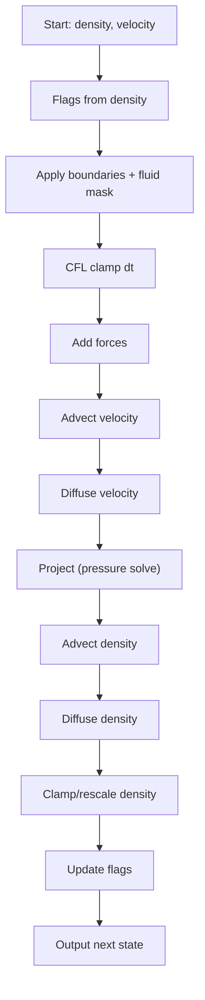

# Density-Based Simulation Step (Detailed)

This document describes the **Density mode** step-by-step, matching the logic in
`src/mac_sim.rs` (`step`). The density field is used as a simple surface proxy by
thresholding it into fluid/air flags.
For the level-set pipeline, see `LEVEL_SET_SIM_STEP.md`.

## Data and Grid Setup

- **Velocity** uses a **MAC grid** (staggered storage):
  - `u` lives on vertical faces (x-velocity).
  - `v` lives on horizontal faces (y-velocity).
- **Density** lives at cell centers and is used to infer the free surface.

### Why density as a surface proxy?
It is simple: advect and diffuse a scalar and treat “dense enough” cells as liquid.
This is fast to iterate on, but the interface tends to smear and behave more like smoke.

## One Simulation Step (Density Mode)

### 1) Build flags from density
- If `density > threshold` => fluid, else air. Solids override.
- Purpose: only project and mask fluid cells, and treat air as free surface.

### 2) Apply boundaries + fluid mask
- Apply domain boundary conditions (no-slip walls) on the staggered velocity.
- Apply solid boundaries (zero velocity on solid-adjacent faces).
- Apply a **fluid mask** to zero faces where both adjacent cells are air.
- Purpose: restrict velocity to fluid regions and avoid pressure artifacts.

### 3) CFL clamp for a stable timestep
- CFL condition: `dt <= cfl * dx / max(|u|)`.
- Purpose: avoid excessive backtracing distances during advection.

### 4) Add forces (gravity + buoyancy + surface tension)
- **Gravity** (body force) is added to velocity.
- **Buoyancy** (optional) pushes based on density vs ambient.
- **Surface tension** (optional) is approximated using density gradients.
- Purpose: drive motion and add surface cohesion.

### 5) Advect velocity (Semi-Lagrangian or BFECC)
- Backtrace each face center to sample the old velocity.
- BFECC reduces numerical diffusion.

### 6) Diffuse velocity (viscosity)
- Apply a Laplacian to model viscous diffusion.

### 7) Pressure projection (incompressibility)
- Compute divergence `∇·u` on cells.
- Solve a Poisson equation for pressure (PCG in this codebase).
- Subtract pressure gradient from velocity.
- Purpose: enforce `∇·u = 0`.

### 8) Advect density
- Backtrace each cell center and sample the density field.

### 9) Diffuse density (optional)
- Apply a Laplacian with a diffusion coefficient.

### 10) Clamp and rescale density (optional)
- Clamp to `[0, 1]` to keep it physically bounded.
- Optionally rescale total mass to preserve volume.

### 11) Update flags again
- Recompute fluid/air flags from density after advection/diffusion.
- Purpose: keep the free surface aligned with the scalar field.

---

## Step Flow (Mermaid)

## Mental Model: Why This Works

- MAC + projection enforces incompressibility, which is the core of liquid motion.
- The density scalar serves as a proxy for the interface, but it is not a true
  surface tracker, so diffusion and advection errors can smear it over time.

If you want, I can add a side-by-side comparison of the two pipelines and the
exact function names used in code.
